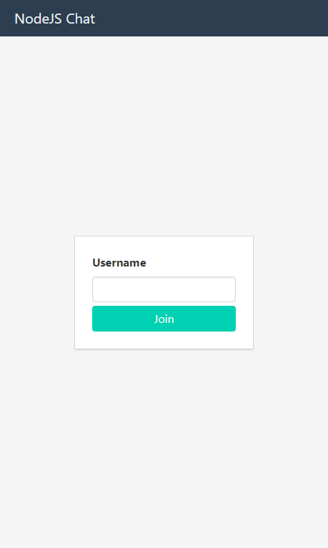
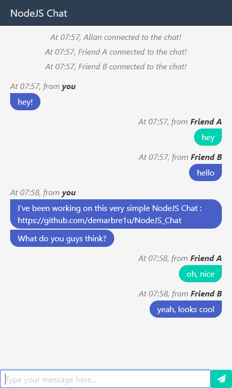

# NodeJS Chat #

## Introduction

<p align="center">
  
  
</p>

This project is a simple NodeJS chat.

It was made using NodeJS and socket.io.

## How do I get set up? ###

You will first need to install the required dependencies :

```bash
npm install
```

Then launch the app using the node command :

```bash
npm start
```

You can run the app in dev mode using Nodemon with the command :  

```bash
npm run dev
```

You can then access the chat via the following URL : http://localhost:8080

The port used can be modified by creating a `.env` file from `.env.sample`, and changing the value of the variable `NODE_CHAT_PORT`.
